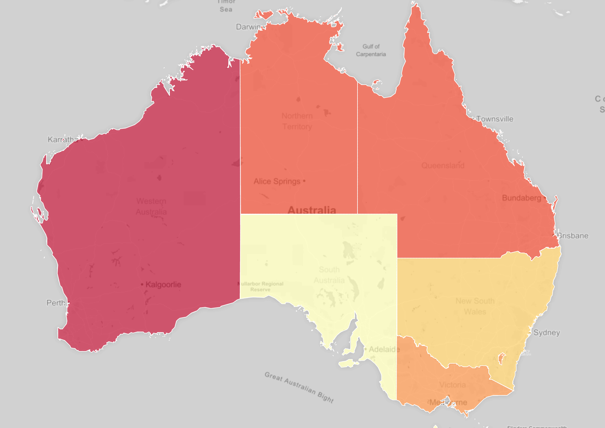

```{r setup, include=FALSE}
knitr::opts_chunk$set(echo = FALSE, message = FALSE, warning = FALSE)

```

## A man named "Andrew Sharpe"...

On the morning of October 9, 2020, Andrew Sharpe was surfing with seven of his friends in Wylie Bay, Western Australia near the town of Esperance. As Sharpe and the other surfers were awaiting their next wave, a massive predator was waiting below.

Sharpe was suddenly struck with massive force by a great white shark, which was reported to be around 15 feet in length, propelling itself from the ocean floor straight into Sharpe sending his body flying through the air. His friends quickly acted, and as Sharpe floated at the surface with obvious injury (he had also been bitten on the leg in the process of being initially struck), they tried desperately to swim to him and get him on a board and back to the beach to get help. As a friend got closer, the shark returned and pulled Sharpe under, and he was never seen again. Authorities recovered his surfboard, with obvious bite marks from a large great white. After three days of searching, all that was found were pieces of his wet suit. 2020 was the most deadly year Australia has had in terms of shark attacks since 1929. 

Shirley Anne Durdin, Robert Pamperin, Lloyd Skinner, Nick Peterson...a few of those who were witnessed to have not only been killed by a shark, but known to have been consumed.

I feel like these events are somewhat of a paradox. Such a tragic, and to be honest, graphic event, and if it were to happen where a human attacked another human in such a way (obviously, not the exact same), the outrage and thirst for justice and in some cases, calls for the blood of the perpetrator, could be heard around the world. But sharks cannot be held to the same standard when such an event occurs. As our population grows and climate change continues to alter ecosystems everywhere, sharks are only trying to adapt and survive. They don't worship serial killers or have a list of human enemies to cross off of a list, they are simply acting on instinct and a need to survive.

Shark attacks (trying to now be called "accidents", which is more fitting I feel) throughout a wide span of time have been recorded into a file known as the "Global Shark Attack File" (GSAF). Something that particularly interested me about the case of Andrew Sharpe was that he was eaten (assumed, with a lot of evidence). That is an incredibly rare phenomenon. The file records injuries and fatalities, but not necessarily those consumed among the fatalities. 

Something to note with the data sets provided is that the "International Shark Attack File" was not established until 1958. Because of this, there are a lot of inconsistencies in some of the data that may be displayed. There are people around the world reporting these incidents, meaning there is no uniform format for inputting the data.

This project aims to analyze and summarize the data as a whole. I cannot emphasize this enough that even with the overwhelmingly graphic stories, I will always remain "Team Shark", as I feel we all should be. I have gained what most would call irrational, but I call a healthy fear and respect for the ocean and sharks especially. I am incredibly grateful to have been born a land based organism, ya feel me?

```{r}
knitr::include_graphics("~/Desktop/my_website/media/andrew_sharpe.png")
```

## A Broad View of the Data

A major hurdle in utilizing this data set for analysis was the lack of consistency. It took an INCREDIBLY long time to organize country names and activities specifically. Another thing to note is that not all country names are 
listed as countries recognized by the United Nations, but for all intents and purposes here, we are only looking at the top few notorious countries known for
attacks. 
```{r, echo = FALSE, message = FALSE, warning = FALSE}

library(tidyverse)
library(easystats)
library(dplyr)
library(janitor)
library(leaps)
library(vroom)
library(zoo)
library(skimr)
library(stringr)
library(geojsonio)
library(broom)
library(rjson)
library(png)
library(pandoc)
library(raster)
library(ggplot2)
library(sf)
library(plotly)
library(rgdal)
library(ozmaps)
library(yaml)

df <- vroom("GSAF5_03:2023.csv")
aus_df <- vroom("australian_shark_incident_database_public.csv")

df_1 <- df[, -16:-255] %>% clean_names()

df_2 = select(df_1, -investigator_or_source, -time, -injury,
              -sex, -name, -age, -location)

#fishing

df_2 <- df_2 %>%
  mutate(activity = ifelse(grepl("Fishing", activity), "fishing", activity)) %>% 
  mutate(activity = ifelse(grepl("fishing", activity), "fishing", activity)) %>% 
  mutate(activity = ifelse(grepl("Fisherman", activity), "fishing", activity)) %>% 
  mutate(activity = ifelse(grepl("Fish", activity), "fishing", activity)) %>% 
  mutate(activity = ifelse(grepl("fish", activity), "fishing", activity)) %>% 
  mutate(activity = ifelse(grepl("Spearfishing", activity), "fishing", activity)) %>% 
  mutate(activity = ifelse(grepl("spearfishing", activity), "fishing", activity)) %>% 
  mutate(activity = ifelse(grepl("sardines", activity), "fishing", activity)) %>% 
  mutate(activity = ifelse(grepl("Clamming", activity), "fishing", activity)) %>% 
  mutate(activity = ifelse(grepl("Crabbing", activity), "fishing", activity)) %>% 
  mutate(activity = ifelse(grepl("shrimp", activity), "fishing", activity)) %>% 
  mutate(activity = ifelse(grepl("lobsters", activity), "fishing", activity)) %>% 
  mutate(activity = ifelse(grepl("whale", activity), "fishing", activity)) %>% 
  mutate(activity = ifelse(grepl("Hunting", activity), "fishing", activity)) %>% 
  mutate(activity = ifelse(grepl("hunting", activity), "fishing", activity)) %>% 
  mutate(activity = ifelse(grepl("Lobstering", activity), "fishing", activity)) %>% 
  mutate(activity = ifelse(grepl("Netting", activity), "fishing", activity)) %>% 
  mutate(activity = ifelse(grepl("netting", activity), "fishing", activity)) %>% 
  mutate(activity = ifelse(grepl("Net", activity), "fishing", activity)) %>% 
  mutate(activity = ifelse(grepl("net", activity), "fishing", activity)) %>% 
  mutate(activity = ifelse(grepl("prawns", activity), "fishing", activity)) %>% 
  mutate(activity = ifelse(grepl("Shrimping", activity), "fishing", activity)) %>% 
  mutate(activity = ifelse(grepl("dolphins", activity), "fishing", activity)) %>% 
  mutate(activity = ifelse(grepl("crocodile", activity), "fishing", activity)) %>% 
  mutate(activity = ifelse(grepl("turtle", activity), "fishing", activity)) %>% 
  mutate(activity = ifelse(grepl("crabs", activity), "fishing", activity)) %>% 
  mutate(activity = ifelse(grepl("stingrays?", activity), "fishing", activity)) %>% 
  mutate(activity = ifelse(grepl("Oystering", activity), "fishing", activity)) %>% 
  mutate(activity = ifelse(grepl("pêcheur de bichiques", activity), "fishing", activity)) %>% 
  mutate(activity = ifelse(grepl("Spearfishing", activity), "fishing", activity)) %>% 
  mutate(activity = ifelse(grepl("Spearishing", activity), "fishing", activity)) %>% 
  mutate(activity = ifelse(grepl("Spearing", activity), "fishing", activity)) %>% 
  mutate(activity = ifelse(grepl("Scalloping", activity), "fishing", activity)) %>% 
  mutate(activity = ifelse(grepl("Removing hook", activity), "fishing", activity)) %>% 
  mutate(activity = ifelse(grepl("Removing shark from a trap", activity), "fishing", activity)) %>% 
  mutate(activity = ifelse(grepl("Killing", activity), "fishing", activity)) %>% 
  mutate(activity = ifelse(grepl("Helping", activity), "fishing", activity)) %>% 
  mutate(activity = ifelse(grepl("Hauling dead", activity), "fishing", activity)) %>% 
  mutate(activity = ifelse(grepl("Harpooned", activity), "fishing", activity)) %>% 
  mutate(activity = ifelse(grepl("Hand lining", activity), "fishing", activity)) %>% 
  mutate(activity = ifelse(grepl("Gigging", activity), "fishing", activity)) %>% 
  mutate(activity = ifelse(grepl("Gaffing", activity), "fishing", activity)) %>% 
  mutate(activity = ifelse(grepl("Finning", activity), "fishing", activity)) %>% 
  mutate(activity = ifelse(grepl("Fihing", activity), "fishing", activity)) %>% 
  mutate(activity = ifelse(grepl("Collecting aquarium", activity), "fishing", activity)) %>% 
  mutate(activity = ifelse(grepl("Collecting beche-de-mer", activity), "fishing", activity)) %>% 
  mutate(activity = ifelse(grepl("Collecting marine", activity), "fishing", activity)) %>% 
  mutate(activity = ifelse(grepl("Chumming", activity), "fishing", activity)) %>% 
  mutate(activity = ifelse(grepl("Baiting", activity), "fishing", activity)) %>% 
  mutate(activity = ifelse(grepl("Angling", activity), "fishing", activity)) %>% 
  mutate(activity = ifelse(grepl("Catching", activity), "fishing", activity)) %>% 
  mutate(activity = ifelse(grepl("NSB", activity), "fishing", activity)) %>% 
  mutate(activity = ifelse(grepl("Went to aid", activity), "fishing", activity)) %>% 
  mutate(activity = ifelse(grepl("Dragging a shark", activity), "fishing", activity)) %>% 
  mutate(activity = ifelse(grepl("Dry shelling", activity), "fishing", activity)) %>% 
  mutate(activity = ifelse(grepl("Holding shark on leader", activity), "fishing", activity)) %>% 
  mutate(activity = ifelse(grepl("Searching", activity), "fishing", activity)) %>% 
  mutate(activity = ifelse(grepl("Returning", activity), "fishing", activity)) %>% 
  mutate(activity = ifelse(grepl("Retrieving bait box", activity), "fishing", activity)) %>% 
  mutate(activity = ifelse(grepl("shark hunt", activity), "fishing", activity)) %>% 
  mutate(activity = ifelse(grepl("Dropping", activity), "fishing", activity)) %>% 
  mutate(activity = ifelse(grepl("Conducting research", activity), "fishing", activity)) %>% 
  mutate(activity = ifelse(grepl("hooked", activity), "fishing", activity)) %>% 
  mutate(activity = ifelse(grepl("Attaching", activity), "fishing", activity)) %>% 
  mutate(activity = ifelse(grepl("Attempting to free", activity), "fishing", activity)) %>% 
  mutate(activity = ifelse(grepl("Attempting to drag", activity), "fishing", activity)) %>% 
  mutate(activity = ifelse(grepl("Shark hoisted", activity), "fishing", activity)) %>% 
  mutate(activity = ifelse(grepl("Gathering", activity), "fishing", activity)) %>% 
  mutate(activity = ifelse(grepl("Fell onto", activity), "fishing", activity))

#swimming_or_diving

df_2 <- df_2 %>% 
  mutate(activity = ifelse(grepl("naked", activity), "swimming_or diving", activity)) %>% 
  mutate(activity = ifelse(grepl("poaching", activity), "swimming_or_diving", activity)) %>% 
  mutate(activity = ifelse(grepl("towing a kayak", activity), "swimming_or_diving", activity)) %>% 
  mutate(activity = ifelse(grepl("towing an empty barrel", activity), "swimming_or_diving", activity)) %>% 
  mutate(activity = ifelse(grepl("carnival", activity), "swimming_or_diving", activity)) %>% 
  mutate(activity = ifelse(grepl("floatioon", activity), "swimming_or_diving", activity)) %>% 
  mutate(activity = ifelse(grepl("Medic", activity), "swimming_or_diving", activity)) %>% 
  mutate(activity = ifelse(grepl("house on pilings", activity), "swimming_or_diving", activity)) %>% 
  mutate(activity = ifelse(grepl("swimming with boogie board", activity), "swimming_or_diving", activity)) %>% 
  mutate(activity = ifelse(grepl("swimming with board", activity), "swimming_or_diving", activity)) %>% 
  mutate(activity = ifelse(grepl("Swimmingq", activity), "swimming_or_diving", activity)) %>% 
  mutate(activity = ifelse(grepl("Swimming/Standing", activity), "swimming_or_diving", activity)) %>% 
  mutate(activity = ifelse(grepl("Swimming/ Treading water", activity), "swimming_or_diving", activity)) %>% 
  mutate(activity = ifelse(grepl("Swimming/", activity), "swimming_or_diving", activity)) %>% 
  mutate(activity = ifelse(grepl("caught in strong backwash", activity), "swimming_or_diving", activity)) %>% 
  mutate(activity = ifelse(grepl("carrying tin can with mail", activity), "swimming_or_diving", activity)) %>% 
  mutate(activity = ifelse(grepl("after falling", activity), "swimming_or_diving", activity)) %>% 
  mutate(activity = ifelse(grepl("Swmming", activity), "swimming_or_diving", activity)) %>% 
  mutate(activity = ifelse(grepl("dived into the water", activity), "swimming_or_diving", activity)) %>% 
  mutate(activity = ifelse(grepl("Swimming", activity), "swimming_or_diving", activity)) %>%
  mutate(activity = ifelse(grepl("Swimming", activity), "swimming_or_diving", activity)) %>% 
  mutate(activity = ifelse(grepl("Wading?", activity), "swimming_or_diving", activity)) %>% 
  mutate(activity = ifelse(grepl("Swimming", activity), "swimming_or_diving", activity)) %>% 
  mutate(activity = ifelse(grepl("Treading water", activity), "swimming_or_diving", activity)) %>% 
  mutate(activity = ifelse(grepl("Treading for clams", activity), "swimming_or_diving", activity)) %>% 
  mutate(activity = ifelse(grepl("Diving", activity), "swimming_or_diving", activity)) %>% 
  mutate(activity = ifelse(grepl("Cage Diving", activity), "swimming_or_diving", activity)) %>% 
  mutate(activity = ifelse(grepl("Trochus diving", activity), "swimming_or_diving", activity)) %>% 
  mutate(activity = ifelse(grepl("swimming", activity), "swimming_or_diving", activity)) %>% 
  mutate(activity = ifelse(grepl("Tech diving", activity), "swimming_or_diving", activity)) %>% 
  mutate(activity = ifelse(grepl("Freediving", activity), "swimming_or_diving", activity)) %>% 
  mutate(activity = ifelse(grepl("Free-diving", activity), "swimming_or_diving", activity)) %>% 
  mutate(activity = ifelse(grepl("Free diving", activity), "swimming_or_diving", activity)) %>% 
  mutate(activity = ifelse(grepl("Dog paddling", activity), "swimming_or_diving", activity)) %>% 
  mutate(activity = ifelse(grepl("Dived", activity), "swimming_or_diving", activity)) %>% 
  mutate(activity = ifelse(grepl("Crouching", activity), "swimming_or_diving", activity)) %>% 
  mutate(activity = ifelse(grepl("Hardhat diving", activity), "swimming_or_diving", activity)) %>% 
  mutate(activity = ifelse(grepl("Hard hat diving", activity), "swimming_or_diving", activity)) %>% 
  mutate(activity = ifelse(grepl("Helmet diving", activity), "swimming_or_diving", activity)) %>% 
  mutate(activity = ifelse(grepl("Hookah diving", activity), "swimming_or_diving", activity)) %>% 
  mutate(activity = ifelse(grepl("waist-deep water", activity), "swimming_or_diving", activity)) %>% 
  mutate(activity = ifelse(grepl("Jumped into", activity), "swimming_or_diving", activity)) %>% 
  mutate(activity = ifelse(grepl("Jumped off rocks", activity), "swimming_or_diving", activity)) %>% 
  mutate(activity = ifelse(grepl("Jumping", activity), "swimming_or_diving", activity)) %>% 
  mutate(activity = ifelse(grepl("Kneeling", activity), "swimming_or_diving", activity)) %>% 
  mutate(activity = ifelse(grepl("Lying in 2 feet", activity), "swimming_or_diving", activity)) %>% 
  mutate(activity = ifelse(grepl("Lying prone", activity), "swimming_or_diving", activity)) %>% 
  mutate(activity = ifelse(grepl("Night bathing", activity), "swimming_or_diving", activity)) %>% 
  mutate(activity = ifelse(grepl("Night diving", activity), "swimming_or_diving", activity)) %>% 
  mutate(activity = ifelse(grepl("Pearl diving", activity), "swimming_or_diving", activity)) %>% 
  mutate(activity = ifelse(grepl("Playing", activity), "swimming_or_diving", activity)) %>% 
  mutate(activity = ifelse(grepl("Scuba diving", activity), "swimming_or_diving", activity)) %>% 
  mutate(activity = ifelse(grepl("Crouching", activity), "swimming_or_diving", activity)) %>% 
  mutate(activity = ifelse(grepl("SCUBA", activity), "swimming_or_diving", activity)) %>% 
  mutate(activity = ifelse(grepl("Shark diving", activity), "swimming_or_diving", activity)) %>% 
  mutate(activity = ifelse(grepl("Shell diving", activity), "swimming_or_diving", activity)) %>% 
  mutate(activity = ifelse(grepl("Sitting", activity), "swimming_or_diving", activity)) %>% 
  mutate(activity = ifelse(grepl("Sittting", activity), "swimming_or_diving", activity)) %>% 
  mutate(activity = ifelse(grepl("Skin diving", activity), "swimming_or_diving", activity)) %>% 
  mutate(activity = ifelse(grepl("Skindiving", activity), "swimming_or_diving", activity)) %>% 
  mutate(activity = ifelse(grepl("Snorkeling", activity), "swimming_or_diving", activity)) %>% 
  mutate(activity = ifelse(grepl("Splashing", activity), "swimming_or_diving", activity)) %>% 
  mutate(activity = ifelse(grepl("Sponge", activity), "swimming_or_diving", activity)) %>% 
  mutate(activity = ifelse(grepl("Squatting", activity), "swimming_or_diving", activity)) %>% 
  mutate(activity = ifelse(grepl("Standing in knee-deep", activity), "swimming_or_diving", activity)) %>% 
  mutate(activity = ifelse(grepl("Standing in waist-deep", activity), "swimming_or_diving", activity)) %>% 
  mutate(activity = ifelse(grepl("Standing in water", activity), "swimming_or_diving", activity)) %>% 
  mutate(activity = ifelse(grepl("Washing", activity), "swimming_or_diving", activity)) %>% 
  mutate(activity = ifelse(grepl("Floating or standing", activity), "swimming_or_diving", activity)) %>% 
  mutate(activity = ifelse(grepl("Floating on his back", activity), "swimming_or_diving", activity)) %>% 
  mutate(activity = ifelse(grepl("Floating on back", activity), "swimming_or_diving", activity)) %>% 
  mutate(activity = ifelse(grepl("Fell into the water", activity), "swimming_or_diving", activity)) %>% 
  mutate(activity = ifelse(grepl("Fell from his", activity), "swimming_or_diving", activity)) %>% 
  mutate(activity = ifelse(grepl("Fell from wharf", activity), "swimming_or_diving", activity)) %>% 
  mutate(activity = ifelse(grepl("Dangling feet", activity), "swimming_or_diving", activity)) %>% 
  mutate(activity = ifelse(grepl("chest-deep water", activity), "swimming_or_diving", activity)) %>% 
  mutate(activity = ifelse(grepl("Floating face-down", activity), "swimming_or_diving", activity)) %>% 
  mutate(activity = ifelse(grepl("Filming", activity), "swimming_or_diving", activity)) %>% 
  mutate(activity = ifelse(grepl("Bathing", activity), "swimming_or_diving", activity)) %>% 
  mutate(activity = ifelse(grepl("Attempting to swim across", activity), "swimming_or_diving", activity)) %>% 
  mutate(activity = ifelse(grepl("Attempting to set", activity), "swimming_or_diving", activity)) %>% 
  mutate(activity = ifelse(grepl("Attempting to illegally", activity), "swimming_or_diving", activity)) %>% 
  mutate(activity = ifelse(grepl("Bather", activity), "swimming_or_diving", activity)) %>% 
  mutate(activity = ifelse(grepl("Ascending", activity), "swimming_or_diving", activity)) %>% 
  mutate(activity = ifelse(grepl("4 men", activity), "swimming_or_diving", activity)) %>% 
  mutate(activity = ifelse(grepl("A father bathing", activity), "swimming_or_diving", activity)) %>% 
  mutate(activity = ifelse(grepl("Ascending", activity), "swimming_or_diving", activity)) %>% 
  mutate(activity = ifelse(grepl("Commercial", activity), "swimming_or_diving", activity)) %>% 
  mutate(activity = ifelse(grepl("Competing", activity), "swimming_or_diving", activity)) %>% 
  mutate(activity = ifelse(grepl("Dress diving", activity), "swimming_or_diving", activity)) %>% 
  mutate(activity = ifelse(grepl("Floating face", activity), "swimming_or_diving", activity)) %>% 
  mutate(activity = ifelse(grepl("Hilo", activity), "swimming_or_diving", activity)) %>% 
  mutate(activity = ifelse(grepl("In water with", activity), "swimming_or_diving", activity)) %>% 
  mutate(activity = ifelse(grepl("In deep water", activity), "swimming_or_diving", activity)) %>% 
  mutate(activity = ifelse(grepl("Probabable", activity), "swimming_or_diving", activity)) %>% 
  mutate(activity = ifelse(grepl("Testing movie camera", activity), "swimming_or_diving", activity)) %>% 
  mutate(activity = ifelse(grepl("Underwater", activity), "swimming_or_diving", activity)) %>% 
  mutate(activity = ifelse(grepl("bathing", activity), "swimming_or_diving", activity)) %>% 
  mutate(activity = ifelse(grepl("Batin", activity), "swimming_or_diving", activity)) %>% 
  mutate(activity = ifelse(grepl("Alacatraz", activity), "swimming_or_diving", activity)) %>% 
  mutate(activity = ifelse(grepl("Knocked", activity), "swimming_or_diving", activity)) %>% 
  mutate(activity = ifelse(grepl("Leaving", activity), "swimming_or_diving", activity)) %>% 
  mutate(activity = ifelse(grepl("Lifesaving", activity), "swimming_or_diving", activity)) %>% 
  mutate(activity = ifelse(grepl("Lifeguard", activity), "swimming_or_diving", activity)) %>% 
  mutate(activity = ifelse(grepl("Lashing", activity), "swimming_or_diving", activity)) %>% 
  mutate(activity = ifelse(grepl("Crossing", activity), "swimming_or_diving", activity)) %>%
  mutate(activity = ifelse(grepl("Walking", activity), "swimming_or_diving", activity)) %>% 
  mutate(activity = ifelse(grepl("Working", activity), "swimming_or_diving", activity)) %>% 
  mutate(activity = ifelse(grepl("Slipped", activity), "swimming_or_diving", activity)) %>% 
  mutate(activity = ifelse(grepl("Lobster diving", activity), "swimming_or_diving", activity)) %>% 
  mutate(activity = ifelse(grepl("On a float", activity), "swimming_or_diving", activity)) %>% 
  mutate(activity = ifelse(grepl("Scientific research", activity), "swimming_or_diving", activity)) %>% 
  mutate(activity = ifelse(grepl("Slipped", activity), "swimming_or_diving", activity)) %>% 
  mutate(activity = ifelse(grepl("Taking wife", activity), "swimming_or_diving", activity)) %>% 
  mutate(activity = ifelse(grepl("Steinhart", activity), "swimming_or_diving", activity)) %>% 
  mutate(activity = ifelse(grepl("Stamding", activity), "swimming_or_diving", activity)) %>% 
  mutate(activity = ifelse(grepl("Steinhart", activity), "swimming_or_diving", activity)) %>% 
  mutate(activity = ifelse(grepl("Scallop diving", activity), "swimming_or_diving", activity)) %>% 
  mutate(activity = ifelse(grepl("seaweeds", activity), "swimming_or_diving", activity)) %>% 
  mutate(activity = ifelse(grepl("Fleeing", activity), "swimming_or_diving", activity)) %>% 
  mutate(activity = ifelse(grepl("Exercising", activity), "swimming_or_diving", activity)) %>% 
  mutate(activity = ifelse(grepl("Conch", activity), "swimming_or_diving", activity)) %>% 
  mutate(activity = ifelse(grepl("Bending", activity), "swimming_or_diving", activity)) %>% 
  mutate(activity = ifelse(grepl("Abalone diving", activity), "swimming_or_diving", activity)) %>% 
  mutate(activity = ifelse(grepl("After rowing", activity), "swimming_or_diving", activity)) %>% 
  mutate(activity = ifelse(grepl("Attacked", activity), "swimming_or_diving", activity)) %>% 
  mutate(activity = ifelse(grepl("Attempting to fix", activity), "swimming_or_diving", activity)) %>% 
  mutate(activity = ifelse(grepl("repairing the stern", activity), "swimming_or_diving", activity)) %>% 
  mutate(activity = ifelse(grepl("drowning man", activity), "swimming_or_diving", activity)) %>% 
  mutate(activity = ifelse(grepl("rescue shipmate", activity), "swimming_or_diving", activity)) %>% 
  mutate(activity = ifelse(grepl("woman seized", activity), "swimming_or_diving", activity)) %>% 
  mutate(activity = ifelse(grepl("Crawling", activity), "swimming_or_diving", activity)) %>% 
  mutate(activity = ifelse(grepl("preparing", activity), "swimming_or_diving", activity)) %>% 
  mutate(activity = ifelse(grepl("Ran into", activity), "swimming_or_diving", activity)) %>% 
  mutate(activity = ifelse(grepl("Scuba", activity), "swimming_or_diving", activity)) %>% 
  mutate(activity = ifelse(grepl("diving for lobster", activity), "swimming_or_diving", activity)) %>% 
  mutate(activity = ifelse(grepl("Floating", activity), "swimming_or_diving", activity)) %>% 
  mutate(activity = ifelse(grepl("Climbing", activity), "swimming_or_diving", activity)) %>% 
  mutate(activity = ifelse(grepl("Cleaning", activity), "swimming_or_diving", activity)) %>% 
  mutate(activity = ifelse(grepl("Collecting", activity), "swimming_or_diving", activity)) %>% 
  mutate(activity = ifelse(grepl("Reaching", activity), "swimming_or_diving", activity)) %>% 
  mutate(activity = ifelse(grepl("Standing in inner", activity), "swimming_or_diving", activity)) %>% 
  mutate(activity = ifelse(grepl("gathering oysters", activity), "swimming_or_diving", activity)) %>% 
  mutate(activity = ifelse(grepl("collecting sea stars", activity), "swimming_or_diving", activity)) %>% 
  mutate(activity = ifelse(grepl("Paddling", activity), "swimming_or_diving", activity)) %>% 
  mutate(activity = ifelse(grepl("Jumped", activity), "swimming_or_diving", activity)) %>% 
  mutate(activity = ifelse(grepl("Standing", activity), "swimming_or_diving", activity)) %>% 
  mutate(activity = ifelse(grepl("Rescuing", activity), "swimming_or_diving", activity))

#air_or_sea_disaster

df_2 <- df_2 %>% 
  mutate(activity = ifelse(grepl("German submarine", activity), "air_or_sea_disaster", activity)) %>% 
  mutate(activity = ifelse(grepl("USS", activity), "air_or_sea_disaster", activity)) %>% 
  mutate(activity = ifelse(grepl("C124", activity), "air_or_sea_disaster", activity)) %>% 
  mutate(activity = ifelse(grepl("U-177", activity), "air_or_sea_disaster", activity)) %>% 
  mutate(activity = ifelse(grepl("troopship", activity), "air_or_sea_disaster", activity)) %>% 
  mutate(activity = ifelse(grepl("Geiser", activity), "air_or_sea_disaster", activity)) %>% 
  mutate(activity = ifelse(grepl("Bonnie Dundee", activity), "air_or_sea_disaster", activity)) %>% 
  mutate(activity = ifelse(grepl("Greycliffe", activity), "air_or_sea_disaster", activity)) %>% 
  mutate(activity = ifelse(grepl("SS Potlach", activity), "air_or_sea_disaster", activity)) %>% 
  mutate(activity = ifelse(grepl("Trashman", activity), "air_or_sea_disaster", activity)) %>% 
  mutate(activity = ifelse(grepl("Gooney Bird", activity), "air_or_sea_disaster", activity)) %>% 
  mutate(activity = ifelse(grepl("982-ton", activity), "air_or_sea_disaster", activity)) %>% 
  mutate(activity = ifelse(grepl("Michael Howell", activity), "air_or_sea_disaster", activity)) %>% 
  mutate(activity = ifelse(grepl("yachting accident", activity), "air_or_sea_disaster", activity)) %>% 
  mutate(activity = ifelse(grepl("Wreck", activity), "air_or_sea_disaster", activity)) %>% 
  mutate(activity = ifelse(grepl("Esperanza", activity), "air_or_sea_disaster", activity)) %>% 
  mutate(activity = ifelse(grepl("Kapuna", activity), "air_or_sea_disaster", activity)) %>% 
  mutate(activity = ifelse(grepl("Dona Marilyn", activity), "air_or_sea_disaster", activity)) %>% 
  mutate(activity = ifelse(grepl("3540-ton", activity), "air_or_sea_disaster", activity)) %>% 
  mutate(activity = ifelse(grepl("426-ton", activity), "air_or_sea_disaster", activity)) %>% 
  mutate(activity = ifelse(grepl("500-ton", activity), "air_or_sea_disaster", activity)) %>% 
  mutate(activity = ifelse(grepl("6711-ton", activity), "air_or_sea_disaster", activity)) %>% 
  mutate(activity = ifelse(grepl("240-ton", activity), "air_or_sea_disaster", activity)) %>% 
  mutate(activity = ifelse(grepl("Permina", activity), "air_or_sea_disaster", activity)) %>% 
  mutate(activity = ifelse(grepl("Vessel", activity), "air_or_sea_disaster", activity)) %>% 
  mutate(activity = ifelse(grepl("Two canoes", activity), "air_or_sea_disaster", activity)) %>% 
  mutate(activity = ifelse(grepl("Sinking", activity), "air_or_sea_disaster", activity)) %>% 
  mutate(activity = ifelse(grepl("Shipwrecked", activity), "air_or_sea_disaster", activity)) %>% 
  mutate(activity = ifelse(grepl("Tahitienne", activity), "air_or_sea_disaster", activity)) %>% 
  mutate(activity = ifelse(grepl("Mosli", activity), "air_or_sea_disaster", activity)) %>% 
  mutate(activity = ifelse(grepl("schooner Elizabeth", activity), "air_or_sea_disaster", activity)) %>% 
  mutate(activity = ifelse(grepl("Vula", activity), "air_or_sea_disaster", activity)) %>% 
  mutate(activity = ifelse(grepl("Dwarka", activity), "air_or_sea_disaster", activity)) %>% 
  mutate(activity = ifelse(grepl("Cutty Sark", activity), "air_or_sea_disaster", activity)) %>% 
  mutate(activity = ifelse(grepl("Pioneer Cebu", activity), "air_or_sea_disaster", activity)) %>% 
  mutate(activity = ifelse(grepl("bailing out of jet", activity), "air_or_sea_disaster", activity)) %>%
  mutate(activity = ifelse(grepl("Columbus", activity), "air_or_sea_disaster", activity)) %>% 
  mutate(activity = ifelse(grepl("Sea Disaster", activity), "air_or_sea_disaster", activity)) %>% 
  mutate(activity = ifelse(grepl("Sea disaster", activity), "air_or_sea_disaster", activity)) %>% 
  mutate(activity = ifelse(grepl("Ramos", activity), "air_or_sea_disaster", activity)) %>% 
  mutate(activity = ifelse(grepl("S2F-1", activity), "air_or_sea_disaster", activity)) %>% 
  mutate(activity = ifelse(grepl("S2N", activity), "air_or_sea_disaster", activity)) %>% 
  mutate(activity = ifelse(grepl("DC-6B", activity), "air_or_sea_disaster", activity)) %>% 
  mutate(activity = ifelse(grepl("R5D", activity), "air_or_sea_disaster", activity)) %>% 
  mutate(activity = ifelse(grepl("Portuguese Airliner", activity), "air_or_sea_disaster", activity)) %>% 
  mutate(activity = ifelse(grepl("Plane forced", activity), "air_or_sea_disaster", activity)) %>% 
  mutate(activity = ifelse(grepl("powerboat", activity), "air_or_sea_disaster", activity)) %>% 
  mutate(activity = ifelse(grepl("DC7B", activity), "air_or_sea_disaster", activity)) %>% 
  mutate(activity = ifelse(grepl("Baby Princesa", activity), "air_or_sea_disaster", activity)) %>% 
  mutate(activity = ifelse(grepl("Rebel Belle", activity), "air_or_sea_disaster", activity)) %>% 
  mutate(activity = ifelse(grepl("Light aircraft", activity), "air_or_sea_disaster", activity)) %>% 
  mutate(activity = ifelse(grepl("Battle of the Bismarck", activity), "air_or_sea_disaster", activity)) %>% 
  mutate(activity = ifelse(grepl("Bokuyo Maru", activity), "air_or_sea_disaster", activity)) %>% 
  mutate(activity = ifelse(grepl("Principessa", activity), "air_or_sea_disaster", activity)) %>% 
  mutate(activity = ifelse(grepl("Camperdown", activity), "air_or_sea_disaster", activity)) %>% 
  mutate(activity = ifelse(grepl("U-559", activity), "air_or_sea_disaster", activity)) %>% 
  mutate(activity = ifelse(grepl("Duncan DD", activity), "air_or_sea_disaster", activity)) %>% 
  mutate(activity = ifelse(grepl("Arisan Maru", activity), "air_or_sea_disaster", activity)) %>% 
  mutate(activity = ifelse(grepl("light cruiser", activity), "air_or_sea_disaster", activity)) %>% 
  mutate(activity = ifelse(grepl("La Seyne", activity), "air_or_sea_disaster", activity)) %>% 
  mutate(activity = ifelse(grepl("Caribou", activity), "air_or_sea_disaster", activity)) %>% 
  mutate(activity = ifelse(grepl("Caribbee", activity), "air_or_sea_disaster", activity)) %>% 
  mutate(activity = ifelse(grepl("Belmore", activity), "air_or_sea_disaster", activity)) %>% 
  mutate(activity = ifelse(grepl("9 m launch", activity), "air_or_sea_disaster", activity)) %>% 
  mutate(activity = ifelse(grepl("destroyer", activity), "air_or_sea_disaster", activity)) %>% 
  mutate(activity = ifelse(grepl("Raytheon", activity), "air_or_sea_disaster", activity)) %>% 
  mutate(activity = ifelse(grepl("Shipwreck", activity), "air_or_sea_disaster", activity)) %>% 
  mutate(activity = ifelse(grepl("William Penn", activity), "air_or_sea_disaster", activity)) %>% 
  mutate(activity = ifelse(grepl("torpedoed", activity), "air_or_sea_disaster", activity)) %>% 
  mutate(activity = ifelse(grepl("Schooner sank", activity), "air_or_sea_disaster", activity)) %>% 
  mutate(activity = ifelse(grepl("Sagay", activity), "air_or_sea_disaster", activity)) %>% 
  mutate(activity = ifelse(grepl("Plane crashed", activity), "air_or_sea_disaster", activity)) %>% 
  mutate(activity = ifelse(grepl("cable ship", activity), "air_or_sea_disaster", activity)) %>% 
  mutate(activity = ifelse(grepl("blackbirding", activity), "air_or_sea_disaster", activity)) %>% 
  mutate(activity = ifelse(grepl("Explosion", activity), "air_or_sea_disaster", activity)) %>% 
  mutate(activity = ifelse(grepl("Dona Paz", activity), "air_or_sea_disaster", activity)) %>% 
  mutate(activity = ifelse(grepl("Ferry", activity), "air_or_sea_disaster", activity)) %>% 
  mutate(activity = ifelse(grepl("Ditched", activity), "air_or_sea_disaster", activity)) %>% 
  mutate(activity = ifelse(grepl("Avianca", activity), "air_or_sea_disaster", activity)) %>% 
  mutate(activity = ifelse(grepl("Rio Atrato", activity), "air_or_sea_disaster", activity)) %>% 
  mutate(activity = ifelse(grepl("Woodvale", activity), "air_or_sea_disaster", activity)) %>% 
  mutate(activity = ifelse(grepl("Copra", activity), "air_or_sea_disaster", activity)) %>% 
  mutate(activity = ifelse(grepl("Crossing inlet", activity), "air_or_sea_disaster", activity)) %>% 
  mutate(activity = ifelse(grepl("Cutter", activity), "air_or_sea_disaster", activity)) %>% 
  mutate(activity = ifelse(grepl("Nazarene", activity), "air_or_sea_disaster", activity)) %>% 
  mutate(activity = ifelse(grepl("Ejected", activity), "air_or_sea_disaster", activity)) %>% 
  mutate(activity = ifelse(grepl("Fell overboard", activity), "air_or_sea_disaster", activity)) %>% 
  mutate(activity = ifelse(grepl("Fell oveboard", activity), "air_or_sea_disaster", activity)) %>% 
  mutate(activity = ifelse(grepl("Fell or jumped", activity), "air_or_sea_disaster", activity)) %>% 
  mutate(activity = ifelse(grepl("Yacht", activity), "air_or_sea_disaster", activity)) %>% 
  mutate(activity = ifelse(grepl("yachtsman", activity), "air_or_sea_disaster", activity)) %>% 
  mutate(activity = ifelse(grepl("deckhand", activity), "air_or_sea_disaster", activity)) %>% 
  mutate(activity = ifelse(grepl("Went overboard", activity), "air_or_sea_disaster", activity)) %>% 
  mutate(activity = ifelse(grepl("Swept off", activity), "air_or_sea_disaster", activity)) %>% 
  mutate(activity = ifelse(grepl("Survived US Naval", activity), "air_or_sea_disaster", activity)) %>% 
  mutate(activity = ifelse(grepl("C-46", activity), "air_or_sea_disaster", activity)) %>% 
  mutate(activity = ifelse(grepl("Steamer", activity), "air_or_sea_disaster", activity)) %>% 
  mutate(activity = ifelse(grepl("Sitting in bow", activity), "air_or_sea_disaster", activity)) %>% 
  mutate(activity = ifelse(grepl("Rizal", activity), "air_or_sea_disaster", activity)) %>% 
  mutate(activity = ifelse(grepl("Ship's boat capsized", activity), "air_or_sea_disaster", activity)) %>% 
  mutate(activity = ifelse(grepl("Ship lay at anchor", activity), "air_or_sea_disaster", activity)) %>% 
  mutate(activity = ifelse(grepl("torpedoes &", activity), "air_or_sea_disaster", activity)) %>% 
  mutate(activity = ifelse(grepl("Sailing on catamaran", activity), "air_or_sea_disaster", activity)) %>% 
  mutate(activity = ifelse(grepl("Salvaging", activity), "air_or_sea_disaster", activity)) %>% 
  mutate(activity = ifelse(grepl("Sulphur Queen", activity), "air_or_sea_disaster", activity)) %>% 
  mutate(activity = ifelse(grepl("Rowing", activity), "air_or_sea_disaster", activity)) %>% 
  mutate(activity = ifelse(grepl("Rolled off", activity), "air_or_sea_disaster", activity)) %>% 
  mutate(activity = ifelse(grepl("ship sunk", activity), "air_or_sea_disaster", activity)) %>% 
  mutate(activity = ifelse(grepl("Painting", activity), "air_or_sea_disaster", activity)) %>% 
  mutate(activity = ifelse(grepl("Paddling rescue", activity), "air_or_sea_disaster", activity)) %>% 
  mutate(activity = ifelse(grepl("Paddling outrigger", activity), "air_or_sea_disaster", activity)) %>% 
  mutate(activity = ifelse(grepl("Paddling an outrigger", activity), "air_or_sea_disaster", activity)) %>% 
  mutate(activity = ifelse(grepl("Paddling a canoe", activity), "air_or_sea_disaster", activity)) %>% 
  mutate(activity = ifelse(grepl("Paddling & sailing", activity), "air_or_sea_disaster", activity)) %>% 
  mutate(activity = ifelse(grepl("Pacific Seafarer", activity), "air_or_sea_disaster", activity)) %>% 
  mutate(activity = ifelse(grepl("Overturned", activity), "air_or_sea_disaster", activity)) %>% 
  mutate(activity = ifelse(grepl("life raft", activity), "air_or_sea_disaster", activity)) %>% 
  mutate(activity = ifelse(grepl("On inflatable raft", activity), "air_or_sea_disaster", activity)) %>% 
  mutate(activity = ifelse(grepl("earthquake", activity), "air_or_sea_disaster", activity)) %>% 
  mutate(activity = ifelse(grepl("On boat", activity), "air_or_sea_disaster", activity)) %>% 
  mutate(activity = ifelse(grepl("Ocean racing", activity), "air_or_sea_disaster", activity)) %>% 
  mutate(activity = ifelse(grepl("native boats", activity), "air_or_sea_disaster", activity)) %>% 
  mutate(activity = ifelse(grepl("fell overboard", activity), "air_or_sea_disaster", activity)) %>% 
  mutate(activity = ifelse(grepl("Tropical sank", activity), "air_or_sea_disaster", activity)) %>% 
  mutate(activity = ifelse(grepl("Lifeboat capsized", activity), "air_or_sea_disaster", activity)) %>% 
  mutate(activity = ifelse(grepl("Knocked overboard", activity), "air_or_sea_disaster", activity)) %>% 
  mutate(activity = ifelse(grepl("Jumped overboard", activity), "air_or_sea_disaster", activity)) %>% 
  mutate(activity = ifelse(grepl("over side of boat", activity), "air_or_sea_disaster", activity)) %>% 
  mutate(activity = ifelse(grepl("Watercraft", activity), "air_or_sea_disaster", activity)) %>% 
  mutate(activity = ifelse(grepl("Washed overboard", activity), "air_or_sea_disaster", activity)) %>% 
  mutate(activity = ifelse(grepl("Huncliff", activity), "air_or_sea_disaster", activity)) %>% 
  mutate(activity = ifelse(grepl("Washed off catamaran", activity), "air_or_sea_disaster", activity)) %>% 
  mutate(activity = ifelse(grepl("Washed off raft", activity), "air_or_sea_disaster", activity)) %>% 
  mutate(activity = ifelse(grepl("Boat", activity), "air_or_sea_disaster", activity)) %>% 
  mutate(activity = ifelse(grepl("boat", activity), "air_or_sea_disaster", activity)) %>% 
  mutate(activity = ifelse(grepl("Boat exploded", activity), "air_or_sea_disaster", activity)) %>% 
  mutate(activity = ifelse(grepl("Boating", activity), "air_or_sea_disaster", activity)) %>% 
  mutate(activity = ifelse(grepl("Boeing", activity), "air_or_sea_disaster", activity)) %>% 
  mutate(activity = ifelse(grepl("Aircraft", activity), "air_or_sea_disaster", activity)) %>% 
  mutate(activity = ifelse(grepl("Air Disaster", activity), "air_or_sea_disaster", activity)) %>% 
  mutate(activity = ifelse(grepl("Air disaster", activity), "air_or_sea_disaster", activity)) %>% 
  mutate(activity = ifelse(grepl("Mormackite", activity), "air_or_sea_disaster", activity)) %>% 
  mutate(activity = ifelse(grepl("Orator", activity), "air_or_sea_disaster", activity)) %>% 
  mutate(activity = ifelse(grepl("Argentine", activity), "air_or_sea_disaster", activity)) %>% 
  mutate(activity = ifelse(grepl("Arsinoe", activity), "air_or_sea_disaster", activity)) %>% 
  mutate(activity = ifelse(grepl("B-24", activity), "air_or_sea_disaster", activity)) %>% 
  mutate(activity = ifelse(grepl("Boarding a ship", activity), "air_or_sea_disaster", activity)) %>% 
  mutate(activity = ifelse(grepl("Missouri", activity), "air_or_sea_disaster", activity)) %>% 
  mutate(activity = ifelse(grepl("C47", activity), "air_or_sea_disaster", activity)) %>% 
  mutate(activity = ifelse(grepl("Macedon", activity), "air_or_sea_disaster", activity)) %>% 
  mutate(activity = ifelse(grepl("Canoe", activity), "air_or_sea_disaster", activity)) %>% 
  mutate(activity = ifelse(grepl("Canoeing", activity), "air_or_sea_disaster", activity)) %>% 
  mutate(activity = ifelse(grepl("canoeing", activity), "air_or_sea_disaster", activity)) %>% 
  mutate(activity = ifelse(grepl("Dara", activity), "air_or_sea_disaster", activity)) %>% 
  mutate(activity = ifelse(grepl("El Gamil", activity), "air_or_sea_disaster", activity)) %>% 
  mutate(activity = ifelse(grepl("cargo ship", activity), "air_or_sea_disaster", activity)) %>% 
  mutate(activity = ifelse(grepl("Clinging", activity), "air_or_sea_disaster", activity)) %>% 
  mutate(activity = ifelse(grepl("210-ton", activity), "air_or_sea_disaster", activity)) %>% 
  mutate(activity = ifelse(grepl("barque", activity), "air_or_sea_disaster", activity)) %>% 
  mutate(activity = ifelse(grepl("a canoe", activity), "air_or_sea_disaster", activity)) %>% 
  mutate(activity = ifelse(grepl("dhow capsized", activity), "air_or_sea_disaster", activity)) %>% 
  mutate(activity = ifelse(grepl("survivors on a raft", activity), "air_or_sea_disaster", activity)) %>% 
  mutate(activity = ifelse(grepl("Abandoning", activity), "air_or_sea_disaster", activity)) %>% 
  mutate(activity = ifelse(grepl("dragged overboard", activity), "air_or_sea_disaster", activity)) %>% 
  mutate(activity = ifelse(grepl("thrown overboard", activity), "air_or_sea_disaster", activity)) %>% 
  mutate(activity = ifelse(grepl("Adrift", activity), "air_or_sea_disaster", activity)) %>% 
  mutate(activity = ifelse(grepl("Cutter", activity), "air_or_sea_disaster", activity)) %>% 
  mutate(activity = ifelse(grepl("Dropped overboard", activity), "air_or_sea_disaster", activity)) %>% 
  mutate(activity = ifelse(grepl("Crossing river", activity), "air_or_sea_disaster", activity)) %>% 
  mutate(activity = ifelse(grepl("Fell from the", activity), "air_or_sea_disaster", activity)) %>% 
  mutate(activity = ifelse(grepl("Fell from yardarm", activity), "air_or_sea_disaster", activity)) %>% 
  mutate(activity = ifelse(grepl("Lakonia", activity), "air_or_sea_disaster", activity)) %>% 
  mutate(activity = ifelse(grepl("Dorsetshire", activity), "air_or_sea_disaster", activity)) %>% 
  mutate(activity = ifelse(grepl("Swept", activity), "air_or_sea_disaster", activity)) %>% 
  mutate(activity = ifelse(grepl("Penang's", activity), "air_or_sea_disaster", activity)) %>% 
  mutate(activity = ifelse(grepl("New Venture", activity), "air_or_sea_disaster", activity)) %>% 
  mutate(activity = ifelse(grepl("catamaran capsized", activity), "air_or_sea_disaster", activity)) %>% 
  mutate(activity = ifelse(grepl("Happy Jack", activity), "air_or_sea_disaster", activity)) %>% 
  mutate(activity = ifelse(grepl("Chieh Lee", activity), "air_or_sea_disaster", activity)) %>% 
  mutate(activity = ifelse(grepl("Irene", activity), "air_or_sea_disaster", activity)) %>% 
  mutate(activity = ifelse(grepl("European civilians", activity), "air_or_sea_disaster", activity)) %>% 
  mutate(activity = ifelse(grepl("Aircraft exploded", activity), "air_or_sea_disaster", activity)) %>% 
  mutate(activity = ifelse(grepl("shipwrecked", activity), "air_or_sea_disaster", activity)) %>% 
  mutate(activity = ifelse(grepl("Fleet of canoes", activity), "air_or_sea_disaster", activity)) %>% 
  mutate(activity = ifelse(grepl("Mezada", activity), "air_or_sea_disaster", activity)) %>% 
  mutate(activity = ifelse(grepl("Kormoran", activity), "air_or_sea_disaster", activity)) %>% 
  mutate(activity = ifelse(grepl("Sailing", activity), "air_or_sea_disaster", activity)) %>% 
  mutate(activity = ifelse(grepl("Gambier", activity), "air_or_sea_disaster", activity)) %>% 
  mutate(activity = ifelse(grepl("Hoel", activity), "air_or_sea_disaster", activity)) %>% 
  mutate(activity = ifelse(grepl("Vessel", activity), "air_or_sea_disaster", activity)) %>% 
  mutate(activity = ifelse(grepl("C124", activity), "air_or_sea_disaster", activity)) %>% 
  mutate(activity = ifelse(grepl("Airforce crewman", activity), "air_or_sea_disaster", activity)) %>% 
  mutate(activity = ifelse(grepl("U-177", activity), "air_or_sea_disaster", activity)) %>% 
  mutate(activity = ifelse(grepl("Two canoes", activity), "air_or_sea_disaster", activity)) %>% 
  mutate(activity = ifelse(grepl("Transatlantic", activity), "air_or_sea_disaster", activity)) %>% 
  mutate(activity = ifelse(grepl("Torpedoed", activity), "air_or_sea_disaster", activity)) %>% 
  mutate(activity = ifelse(grepl("Thrown overboard", activity), "air_or_sea_disaster", activity)) %>% 
  mutate(activity = ifelse(grepl("Thrown from destroyer", activity), "air_or_sea_disaster", activity)) %>% 
  mutate(activity = ifelse(grepl("25,000-ton", activity), "air_or_sea_disaster", activity)) %>% 
  mutate(activity = ifelse(grepl("Mosli", activity), "air_or_sea_disaster", activity)) %>% 
  mutate(activity = ifelse(grepl("Esperanza", activity), "air_or_sea_disaster", activity)) %>% 
  mutate(activity = ifelse(grepl("Wahoo", activity), "air_or_sea_disaster", activity)) %>% 
  mutate(activity = ifelse(grepl("Britannia", activity), "air_or_sea_disaster", activity)) %>% 
  mutate(activity = ifelse(grepl("Thingvalla", activity), "air_or_sea_disaster", activity)) %>% 
  mutate(activity = ifelse(grepl("Bonnie Dundee", activity), "air_or_sea_disaster", activity)) %>% 
  mutate(activity = ifelse(grepl("Greycliffe", activity), "air_or_sea_disaster", activity)) %>% 
  mutate(activity = ifelse(grepl("Christie", activity), "air_or_sea_disaster", activity)) %>% 
  mutate(activity = ifelse(grepl("San Basilio", activity), "air_or_sea_disaster", activity)) %>% 
  mutate(activity = ifelse(grepl("Skakel", activity), "air_or_sea_disaster", activity)) %>% 
  mutate(activity = ifelse(grepl("Aircaft", activity), "air_or_sea_disaster", activity)) %>% 
  mutate(activity = ifelse(grepl("plane went down", activity), "air_or_sea_disaster", activity)) %>% 
  mutate(activity = ifelse(grepl("A junk", activity), "air_or_sea_disaster", activity)) %>% 
  mutate(activity = ifelse(grepl("pilot launch", activity), "air_or_sea_disaster", activity)) %>% 
  mutate(activity = ifelse(grepl("dory capsized", activity), "air_or_sea_disaster", activity)) %>% 
  mutate(activity = ifelse(grepl("Magpie", activity), "air_or_sea_disaster", activity)) %>% 
  mutate(activity = ifelse(grepl("Hurricane", activity), "air_or_sea_disaster", activity)) %>% 
  mutate(activity = ifelse(grepl("In rubber", activity), "air_or_sea_disaster", activity)) %>% 
  mutate(activity = ifelse(grepl("Leicester", activity), "air_or_sea_disaster", activity)) %>% 
  mutate(activity = ifelse(grepl("Nomad", activity), "air_or_sea_disaster", activity)) %>% 
  mutate(activity = ifelse(grepl("Spent", activity), "air_or_sea_disaster", activity)) %>%
  mutate(activity = ifelse(grepl("Standing on ship", activity), "air_or_sea_disaster", activity)) %>% 
  mutate(activity = ifelse(grepl("Tzenny", activity), "air_or_sea_disaster", activity)) %>% 
  mutate(activity = ifelse(grepl("Parachuted", activity), "air_or_sea_disaster", activity)) %>% 
  mutate(activity = ifelse(grepl("Sculling", activity), "air_or_sea_disaster", activity)) %>% 
  mutate(activity = ifelse(grepl("The cutter", activity), "air_or_sea_disaster", activity)) %>% 
  mutate(activity = ifelse(grepl("His balloon", activity), "air_or_sea_disaster", activity)) %>% 
  mutate(activity = ifelse(grepl("Cruising", activity), "air_or_sea_disaster", activity)) %>% 
  mutate(activity = ifelse(grepl("retreive a dinghy", activity), "air_or_sea_disaster", activity)) %>% 
  mutate(activity = ifelse(grepl("Coming ashore", activity), "air_or_sea_disaster", activity)) %>% 
  mutate(activity = ifelse(grepl("luxury yacht", activity), "air_or_sea_disaster", activity)) %>% 
  mutate(activity = ifelse(grepl("Body found", activity), "air_or_sea_disaster", activity)) %>% 
  mutate(activity = ifelse(grepl("Conducting", activity), "air_or_sea_disaster", activity))
  
#surfing and the like

df_2 <- df_2 %>%
  mutate(activity = ifelse(grepl("Surf", activity), "surfing", activity)) %>% 
  mutate(activity = ifelse(grepl("Windsurfing", activity), "surfing", activity)) %>% 
  mutate(activity = ifelse(grepl("Wind surfing", activity), "surfing", activity)) %>%
  mutate(activity = ifelse(grepl("Water-skiing", activity), "surfing", activity)) %>% 
  mutate(activity = ifelse(grepl("Wakeboarding", activity), "surfing", activity)) %>% 
  mutate(activity = ifelse(grepl("Lying on surfboard", activity), "surfing", activity)) %>% 
  mutate(activity = ifelse(grepl("surfboard", activity), "surfing", activity)) %>% 
  mutate(activity = ifelse(grepl("Paddle Boarding", activity), "surfing", activity)) %>%
  mutate(activity = ifelse(grepl("Paddle boarding", activity), "surfing", activity)) %>% 
  mutate(activity = ifelse(grepl("Paddle Skiing", activity), "surfing", activity)) %>% 
  mutate(activity = ifelse(grepl("Paddle-boarding", activity), "surfing", activity)) %>% 
  mutate(activity = ifelse(grepl("Paddle-surfing", activity), "surfing", activity)) %>% 
  mutate(activity = ifelse(grepl("Paddleboarding", activity), "surfing", activity)) %>% 
  mutate(activity = ifelse(grepl("Paddleskiing", activity), "surfing", activity)) %>% 
  mutate(activity = ifelse(grepl("Paddling on kneeboard", activity), "surfing", activity)) %>% 
  mutate(activity = ifelse(grepl("Paddle on surfboard", activity), "surfing", activity)) %>% 
  mutate(activity = ifelse(grepl("Boggie", activity), "surfing", activity)) %>% 
  mutate(activity = ifelse(grepl("Boogie boarding", activity), "surfing", activity)) %>% 
  mutate(activity = ifelse(grepl("Boogie Boarding", activity), "surfing", activity)) %>% 
  mutate(activity = ifelse(grepl("Bodyboarding", activity), "surfing", activity)) %>% 
  mutate(activity = ifelse(grepl("Body-boarding", activity), "surfing", activity)) %>% 
  mutate(activity = ifelse(grepl("Body surfing", activity), "surfing", activity)) %>% 
  mutate(activity = ifelse(grepl("Body-surfing", activity), "surfing", activity)) %>% 
  mutate(activity = ifelse(grepl("Bodysurfing", activity), "surfing", activity)) %>% 
  mutate(activity = ifelse(grepl("Body boarding", activity), "surfing", activity)) %>% 
  mutate(activity = ifelse(grepl("Body Boarding", activity), "surfing", activity)) %>% 
  mutate(activity = ifelse(grepl("Kite boarding", activity), "surfing", activity)) %>% 
  mutate(activity = ifelse(grepl("Kite Boarding", activity), "surfing", activity)) %>% 
  mutate(activity = ifelse(grepl("Kite surfing", activity), "surfing", activity)) %>% 
  mutate(activity = ifelse(grepl("Kite-Boarding", activity), "surfing", activity)) %>% 
  mutate(activity = ifelse(grepl("Kiteboarding", activity), "surfing", activity)) %>% 
  mutate(activity = ifelse(grepl("Kitesurfing", activity), "surfing", activity)) %>% 
  mutate(activity = ifelse(grepl("Surfing", activity), "surfing", activity)) %>% 
  mutate(activity = ifelse(grepl("Tandem", activity), "surfing", activity)) %>% 
  mutate(activity = ifelse(grepl("SUP", activity), "surfing", activity)) %>% 
  mutate(activity = ifelse(grepl("Skimboarding", activity), "surfing", activity)) %>% 
  mutate(activity = ifelse(grepl("Sailboarding", activity), "surfing", activity)) %>% 
  mutate(activity = ifelse(grepl("Parasailing", activity), "surfing", activity)) %>% 
  mutate(activity = ifelse(grepl("Kite Foiling", activity), "surfing", activity)) %>% 
  mutate(activity = ifelse(grepl("Foil-boarding", activity), "surfing", activity)) %>% 
  mutate(activity = ifelse(grepl("Foilboarding", activity), "surfing", activity)) %>% 
  mutate(activity = ifelse(grepl("Fell off surf", activity), "surfing", activity)) %>% 
  mutate(activity = ifelse(grepl("Board sailing", activity), "surfing", activity)) %>% 
  mutate(activity = ifelse(grepl("Attempting to Kite", activity), "surfing", activity)) %>% 
  mutate(activity = ifelse(grepl("waves on a board", activity), "surfing", activity)) %>% 
  mutate(activity = ifelse(grepl("Racing ski", activity), "surfing", activity)) %>% 
  mutate(activity = ifelse(grepl("Resting", activity), "surfing", activity)) %>% 
  mutate(activity = ifelse(grepl("surfing", activity), "surfing", activity)) %>% 
  mutate(activity = ifelse(grepl("boogie", activity), "surfing", activity)) %>% 
  mutate(activity = ifelse(grepl("Towing her", activity), "surfing", activity)) %>% 
  mutate(activity = ifelse(grepl("Trailing the field", activity), "surfing", activity)) %>% 
  mutate(activity = ifelse(grepl("Pushed", activity), "surfing", activity))
  
#fuck_around_and_find_out

df_2 <- df_2 %>%
  mutate(activity = ifelse(grepl("Petting a shark", activity), "fuck_around_and_find_out", activity)) %>% 
  mutate(activity = ifelse(grepl("Slapped shark", activity), "fuck_around_and_find_out", activity)) %>% 
  mutate(activity = ifelse(grepl("Standing on landed", activity), "fuck_around_and_find_out", activity)) %>% 
  mutate(activity = ifelse(grepl("Stuffing a shark", activity), "fuck_around_and_find_out", activity)) %>% 
  mutate(activity = ifelse(grepl("Teasing", activity), "fuck_around_and_find_out", activity)) %>% 
  mutate(activity = ifelse(grepl("Thrashing the", activity), "fuck_around_and_find_out", activity)) %>% 
  mutate(activity = ifelse(grepl("Touching the mouth", activity), "fuck_around_and_find_out", activity)) %>% 
  mutate(activity = ifelse(grepl("Put foot inside", activity), "fuck_around_and_find_out", activity)) %>% 
  mutate(activity = ifelse(grepl("Putting hand", activity), "fuck_around_and_find_out", activity)) %>% 
  mutate(activity = ifelse(grepl("Placed hand", activity), "fuck_around_and_find_out", activity)) %>% 
  mutate(activity = ifelse(grepl("Picking up", activity), "fuck_around_and_find_out", activity)) %>% 
  mutate(activity = ifelse(grepl("Inebriated", activity), "fuck_around_and_find_out", activity)) %>% 
  mutate(activity = ifelse(grepl("Harassing", activity), "fuck_around_and_find_out", activity)) %>% 
  mutate(activity = ifelse(grepl("Grabbing shark", activity), "fuck_around_and_find_out", activity)) %>% 
  mutate(activity = ifelse(grepl("Grabbed shark", activity), "fuck_around_and_find_out", activity)) %>% 
  mutate(activity = ifelse(grepl("Feeling", activity), "fuck_around_and_find_out", activity)) %>% 
  mutate(activity = ifelse(grepl("Defecating", activity), "fuck_around_and_find_out", activity)) %>% 
  mutate(activity = ifelse(grepl("Attempting to ride", activity), "fuck_around_and_find_out", activity)) %>% 
  mutate(activity = ifelse(grepl("Attempting to kill", activity), "fuck_around_and_find_out", activity)) %>% 
  mutate(activity = ifelse(grepl("Inspecting", activity), "fuck_around_and_find_out", activity)) %>% 
  mutate(activity = ifelse(grepl("Jackass", activity), "fuck_around_and_find_out", activity)) %>% 
  mutate(activity = ifelse(grepl("Attempting to lasso", activity), "fuck_around_and_find_out", activity)) %>% 
  mutate(activity = ifelse(grepl("Shooting", activity), "fuck_around_and_find_out", activity)) %>% 
  mutate(activity = ifelse(grepl("Trailing hand", activity), "fuck_around_and_find_out", activity)) %>% 
  mutate(activity = ifelse(grepl("Pulling shark", activity), "fuck_around_and_find_out", activity)) %>% 
  mutate(activity = ifelse(grepl("Removing shark", activity), "fuck_around_and_find_out", activity)) %>% 
  mutate(activity = ifelse(grepl("Petting", activity), "fuck_around_and_find_out", activity)) %>% 
  mutate(activity = ifelse(grepl("Carrying", activity), "fuck_around_and_find_out", activity)) %>% 
  mutate(activity = ifelse(grepl("Feeding", activity), "fuck_around_and_find_out", activity)) %>% 
  mutate(activity = ifelse(grepl("Moving", activity), "fuck_around_and_find_out", activity)) %>% 
  mutate(activity = ifelse(grepl("On expedition", activity), "fuck_around_and_find_out", activity)) %>% 
  mutate(activity = ifelse(grepl("Photographing the shark", activity), "fuck_around_and_find_out", activity)) %>% 
  mutate(activity = ifelse(grepl("Pulling anchor", activity), "fuck_around_and_find_out", activity)) %>% 
  mutate(activity = ifelse(grepl("Touching", activity), "fuck_around_and_find_out", activity)) %>% 
  mutate(activity = ifelse(grepl("holding shark pup", activity), "fuck_around_and_find_out", activity)) %>% 
  mutate(activity = ifelse(grepl("Hand feeding", activity), "fuck_around_and_find_out", activity)) %>% 
  mutate(activity = ifelse(grepl("Holding", activity), "fuck_around_and_find_out", activity)) %>% 
  mutate(activity = ifelse(grepl("Attempting to drive shark from area", activity), "fuck_around_and_find_out", activity)) %>% 
  mutate(activity = ifelse(grepl("Attempting to drive shark away from sailing", activity), "fuck_around_and_find_out", activity))

#other_or_unknown

df_2 <- df_2 %>%
  mutate(activity = ifelse(grepl("Unknown", activity), "other_or_unknown", activity)) %>% 
  mutate(activity = ifelse(grepl("Suicide", activity), "other_or_unknown", activity)) %>% 
  mutate(activity = ifelse(grepl("Reviving", activity), "other_or_unknown", activity)) %>% 
  mutate(activity = ifelse(grepl("Murder", activity), "other_or_unknown", activity)) %>% 
  mutate(activity = ifelse(grepl("Murdered", activity), "other_or_unknown", activity)) %>% 
  mutate(activity = ifelse(grepl("Captured Allied", activity), "other_or_unknown", activity)) %>% 
  mutate(activity = ifelse(grepl("Riding a horse", activity), "other_or_unknown", activity)) %>% 
  mutate(activity = ifelse(grepl("Riding horseback", activity), "other_or_unknown", activity)) %>% 
  mutate(activity = ifelse(grepl("Human head", activity), "other_or_unknown", activity)) %>% 
  mutate(activity = ifelse(grepl("Disappeared", activity), "other_or_unknown", activity)) %>% 
  mutate(activity = ifelse(grepl("No details", activity), "other_or_unknown", activity)) %>% 
  mutate(activity = ifelse(grepl("Shark tagging", activity), "other_or_unknown", activity)) %>% 
  mutate(activity = ifelse(grepl("Shark watching", activity), "other_or_unknown", activity)) %>% 
  mutate(activity = ifelse(grepl("Tagging sharks", activity), "other_or_unknown", activity)) %>% 
  mutate(activity = ifelse(grepl("Reported swept away", activity), "other_or_unknown", activity)) %>% 
  mutate(activity = ifelse(grepl("Picking", activity), "other_or_unknown", activity)) %>% 
  mutate(activity = ifelse(grepl("Hiking", activity), "other_or_unknown", activity)) %>% 
  mutate(activity = ifelse(grepl("3 men", activity), "other_or_unknown", activity)) %>% 
  mutate(activity = ifelse(grepl("Washed into sea", activity), "other_or_unknown", activity)) %>% 
  mutate(activity = ifelse(grepl("Wrangling", activity), "other_or_unknown", activity)) %>% 
  mutate(activity = ifelse(grepl("Vehicle", activity), "other_or_unknown", activity)) %>% 
  mutate(activity = ifelse(grepl("Trying", activity), "other_or_unknown", activity)) %>% 
  mutate(activity = ifelse(grepl("Lying", activity), "other_or_unknown", activity)) %>% 
  mutate(activity = ifelse(grepl("Photo shoot", activity), "other_or_unknown", activity)) %>% 
  mutate(activity = ifelse(grepl("Retrieving", activity), "other_or_unknown", activity)) %>% 
  mutate(activity = ifelse(grepl("Testing", activity), "other_or_unknown", activity)) %>% 
  mutate(activity = ifelse(grepl("Towing", activity), "other_or_unknown", activity)) %>% 
  mutate(activity = ifelse(grepl("Watching", activity), "other_or_unknown", activity)) %>% 
  mutate(activity = ifelse(grepl("Measuring", activity), "other_or_unknown", activity)) %>% 
  mutate(activity = ifelse(grepl("Investigating", activity), "other_or_unknown", activity)) %>% 
  mutate(activity = ifelse(grepl("Sight-seeing", activity), "other_or_unknown", activity)) %>% 
  mutate(activity = ifelse(grepl("Sightseeing", activity), "other_or_unknown", activity)) %>% 
  mutate(activity = ifelse(grepl("Pulling", activity), "other_or_unknown", activity)) %>% 
  mutate(activity = ifelse(grepl("Riding", activity), "other_or_unknown", activity)) %>% 
  mutate(activity = ifelse(grepl("male", activity), "other_or_unknown", activity)) %>% 
  mutate(activity = ifelse(grepl("anesthetize", activity), "other_or_unknown", activity)) %>% 
  mutate(activity = ifelse(grepl("Dragging stranded", activity), "other_or_unknown", activity)) %>% 
  mutate(activity = ifelse(grepl("Dragging banana", activity), "other_or_unknown", activity)) %>% 
  mutate(activity = ifelse(grepl("Attempted to return", activity), "other_or_unknown", activity)) %>%
  mutate(activity = ifelse(grepl("Attempting to rescue", activity), "other_or_unknown", activity)) %>% 
  mutate(activity = ifelse(grepl("Attempting to drive shark away from the beach", activity), "other_or_unknown", activity)) %>% 
  mutate(activity = ifelse(grepl("Attempting to chase", activity), "other_or_unknown", activity)) %>% 
  mutate(activity = ifelse(grepl("Restraining", activity), "other_or_unknown", activity))

#watercraft

df_2 <- df_2 %>% 
  mutate(activity = ifelse(grepl("Kayaking", activity), "watercraft", activity)) %>% 
  mutate(activity = ifelse(grepl("Kakaying", activity), "watercraft", activity)) %>% 
  mutate(activity = ifelse(grepl("Jet", activity), "watercraft", activity))

print(df_2)

```

## Total Number of "Attacks"

```{r, echo = FALSE, message = FALSE, warning = FALSE}

library(tidyverse)
library(easystats)
library(dplyr)
library(janitor)
library(leaps)
library(vroom)
library(zoo)
library(skimr)
library(stringr)
library(geojsonio)
library(broom)
library(rjson)
library(png)
library(pandoc)
library(raster)
library(ggplot2)
library(sf)
library(plotly)
library(rgdal)
library(ozmaps)
library(yaml)

df_2_year <- 
  df_2 %>% 
  group_by(year) %>% 
  filter(!is.na(year)) %>% 
  count()

df_2_year %>% 
  ggplot() +
  geom_line(aes(x = year, y = n) , color = "blue") +  theme_bw() + 
  labs(x = "Years", y = "Number of Attacks") + theme(legend.position="none") +
  ggtitle("Attacks by Year")

```

## Total Number of "Attacks" for the Last 50 Years

```{r, echo = FALSE, message = FALSE, warning = FALSE}

library(tidyverse)
library(easystats)
library(dplyr)
library(janitor)
library(leaps)
library(vroom)
library(zoo)
library(skimr)
library(stringr)
library(geojsonio)
library(broom)
library(rjson)
library(png)
library(pandoc)
library(raster)
library(ggplot2)
library(sf)
library(plotly)
library(rgdal)
library(ozmaps)
library(yaml)

fifty_years <- dplyr::filter(df_2, year > 1952)

fifty_subset <- 
  fifty_years %>% 
  group_by(year) %>% 
  filter(!is.na(year)) %>% 
  count()

fifty_subset  %>% 
  ggplot() +
  geom_line(aes(x = year, y = n) , color = "blue") +  theme_bw() + 
  labs(x = "Years", y = "Number of Attacks") + theme(legend.position="none") +
  ggtitle("Attacks by Year for the Last 50 years")

```

## Fatalities Over the Last 50 years

```{r, echo = FALSE, message = FALSE, warning = FALSE}

library(tidyverse)
library(easystats)
library(dplyr)
library(janitor)
library(leaps)
library(vroom)
library(zoo)
library(skimr)
library(stringr)
library(geojsonio)
library(broom)
library(rjson)
library(png)
library(pandoc)
library(raster)
library(ggplot2)
library(sf)
library(plotly)
library(rgdal)
library(ozmaps)
library(yaml)

fatal <- df_2 %>% select(country,fatal_y_n) %>%  
  filter(!is.na(fatal_y_n)) %>%  
  group_by(fatal_y_n) %>% 
  summarise(count=n())

print(fatal)

```

## Total "Attacks" for the Top 10 Countries

```{r, echo = FALSE, message = FALSE, warning = FALSE}

library(tidyverse)
library(easystats)
library(dplyr)
library(janitor)
library(leaps)
library(vroom)
library(zoo)
library(skimr)
library(stringr)
library(geojsonio)
library(broom)
library(rjson)
library(png)
library(pandoc)
library(raster)
library(ggplot2)
library(sf)
library(plotly)
library(rgdal)
library(ozmaps)
library(yaml)

by_country <- df_2 %>%
  group_by(country) %>%
  tally() %>%
  na.omit(by_country) %>% 
  top_n(10)

ggplot(by_country, aes(x = reorder(country, -n), y = n)) +
  geom_bar(stat="identity") +
  xlab("Country") +
  ylab("Number of attacks") +
  theme(axis.text.x  = element_text(angle=45, vjust=0.5, size=8)) +
  geom_text(
    aes(label = n, y = n + 20),
    position = position_dodge(0.9),
    vjust = 0
  )

```

## Attacks by Activity

```{r, echo = FALSE, message = FALSE, warning = FALSE}

library(tidyverse)
library(easystats)
library(dplyr)
library(janitor)
library(leaps)
library(vroom)
library(zoo)
library(skimr)
library(stringr)
library(geojsonio)
library(broom)
library(rjson)
library(png)
library(pandoc)
library(raster)
library(ggplot2)
library(sf)
library(plotly)
library(rgdal)
library(ozmaps)
library(yaml)

df_2_activity <- 
  df_2 %>% 
  group_by(activity) %>% 
  filter(!is.na(activity)) %>% 
  count()

ggplot(df_2_activity, aes(x = reorder(activity, -n), y = n)) +
  geom_bar(stat="identity") +
  xlab("Activity") +
  ylab("Number of attacks") +
  theme(axis.text.x  = element_text(angle=0, vjust=0.5, size=6)) +
  geom_text(
    aes(label = n, y = n),
    position = position_dodge(0.9),
    vjust = 0
  )
```

## Total Fatalities for the Top 10 Countries

```{r, echo = FALSE, message = FALSE, warning = FALSE}

## Total Fatalities for the Top 10 Countries

df_2_activity <- 
  df_2 %>% 
  group_by(activity) %>% 
  filter(!is.na(activity)) %>% 
  count()

by_fatality <- df_2 %>%
  group_by(fatal_y_n, country) %>%
  tally() %>%
  na.omit(by_fatality) %>% 
  top_n(10)

ggplot(by_country, aes(x = reorder(country, -n), y = n)) +
  geom_bar(stat="identity") +
  xlab("Country") +
  ylab("Number of attacks") +
  theme(axis.text.x  = element_text(angle=45, vjust=0.5, size=8)) +
  geom_text(
    aes(label = n, y = n + 20),
    position = position_dodge(0.9),
    vjust = 0
  )


library(tidyverse)
library(easystats)
library(dplyr)
library(janitor)
library(leaps)
library(vroom)
library(zoo)
library(skimr)
library(stringr)
library(geojsonio)
library(broom)
library(rjson)
library(png)
library(pandoc)
library(raster)
library(ggplot2)
library(sf)
library(plotly)
library(rgdal)
library(ozmaps)
library(yaml)


```


```{r, echo = FALSE, message = FALSE, warning = FALSE}

## Surprise Surprise...

#The United States may be the "shark attack" capital of the world, but it is not
#the "shark attack resulting in fatality" capital of the world. 
library(tidyverse)
library(easystats)
library(dplyr)
library(janitor)
library(leaps)
library(vroom)
library(zoo)
library(skimr)
library(stringr)
library(geojsonio)
library(broom)
library(rjson)
library(png)
library(pandoc)
library(raster)
library(ggplot2)
library(sf)
library(plotly)
library(rgdal)
library(ozmaps)
library(yaml)

```


```{r, echo = FALSE, message = FALSE, warning = FALSE}
## Attacks in each Australian State

library(tidyverse)
library(easystats)
library(dplyr)
library(janitor)
library(leaps)
library(vroom)
library(zoo)
library(skimr)
library(stringr)
library(geojsonio)
library(broom)
library(rjson)
library(png)
library(pandoc)
library(raster)
library(ggplot2)
library(sf)
library(plotly)
library(rgdal)
library(ozmaps)
library(yaml)

#aus_df2 <- aus_df2 %>%
  #mutate(state = recode(state, NSW = 'New South Wales', WA = 'Western
                        #Australia', QLD =  'Queensland', SA = 'Southern
                        #Australia', TAS = 'Tasmania', VIC = 'Victoria', 
                        #NT = 'Northern Territory'))

# ggplot(aus_df2, aes(x = state, y = n, fill = "red")) + 
  #geom_bar(stat = "identity") + 
  #labs(x = "States", y = "Number of Attacks") + theme(legend.position="none") +
  #ggtitle("Total Number of Attacks in each State of Australia")

```

## Fatalities in each Australian State

```{r, echo = FALSE, message = FALSE, warning = FALSE}

library(tidyverse)
library(easystats)
library(dplyr)
library(janitor)
library(leaps)
library(vroom)
library(zoo)
library(skimr)
library(stringr)
library(geojsonio)
library(broom)
library(rjson)
library(png)
library(pandoc)
library(raster)
library(ggplot2)
library(sf)
library(plotly)
library(rgdal)
library(ozmaps)
library(yaml)

#ggplot(aus_df4, aes(x = state, y = n, fill = "red")) + 
  #geom_bar(stat = "identity") + 
  #labs(x = "States", y = "Number of Fatalities") + theme(legend.position="none") +
  #ggtitle("Total Number of Fatalities in each State of Australia")

aus_df1 <- aus_df %>% clean_names()

aus_df3 <- aus_df1[aus_df1$victim_injury == 'fatal',]

aus_df3 <- aus_df3 %>%
  mutate(state = recode(state, NSW = 'New South Wales', WA = 'Western Australia', 
                        QLD =  'Queensland', SA = 'Southern Australia', 
                        TAS = 'Tasmania', VIC = 'Victoria', 
                        NT = 'Northern Territory'))

aus_df4 <- aus_df3 %>% 
  group_by(state) %>% 
  filter(!is.na(state)) %>% 
  count()

ggplot(aus_df4, aes(x = state, y = n, fill = "red")) + 
  geom_bar(stat = "identity") + 
  labs(x = "States", y = "Number of Fatalities") + theme(legend.position="none") +
  ggtitle("Total Number of Fatalities in each State of Australia")

```

## Observing Fatalities in Australia

My map has yet to be fully successful in merging the dataset containing known latitude and longitude values provided by the Taronga Zoo of Sydney. But as we
can see above, the state of New South Wales has experienced the most fatalities. While the Northern Territory saw the least.

```{r, echo = FALSE, message = FALSE, warning = FALSE}

library(tidyverse)
library(easystats)
library(dplyr)
library(janitor)
library(leaps)
library(vroom)
library(zoo)
library(skimr)
library(stringr)
library(geojsonio)
library(broom)
library(rjson)
library(png)
library(pandoc)
library(raster)
library(ggplot2)
library(sf)
library(plotly)
library(rgdal)
library(ozmaps)
library(yaml)



```

## Conclusion

As we can see from the data, the numbers of attacks compared to the amount of people who have entered the ocean over the last 2000 years, which I can only assume is in the millions, is quite a small fraction. It is widely known that you have a greater chance of being in a plane crash than being attacked by a shark. However, there is always a chance.

There are so many possibilities as to why the United States is the leader in global shark attacks as well as the causes for Australia experiencing the most fatalities. Mammal migration patterns, currents, climate change, increases in human population around the world (meaning more people going to the beach), habitat loss, dumb ass fishermen throwing waste from fish caught back into the ocean while near public beaches...the list goes on.

It is important to note that though these accidents are tragic, what is often overlooked is the fact that humans continue to kill huge amounts of sharks at astounding rates. In an article published in "Marine Policy" in 2012, it is estimated based on data collected that between 63 and 273 million sharks are
killed each year due to human causes.
